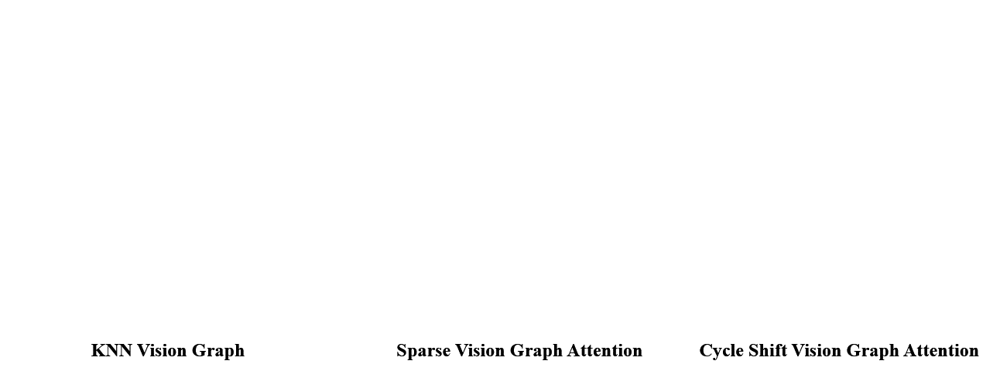

# CS-ViG-UNet: Enhancing Infrared Small and Dim Target Detection with Vision Graph Convolution 




## Datasets

- The SIRST Augment dataset: download from [Google Drive](https://drive.google.com/file/d/13hhEwYHU19oxanXYf-wUpZ7JtiwY8LuT/view?usp=sharing) or [BaiduYun Drive](https://pan.baidu.com/s/1c35pADjPhkAcLwmU-u0RBA) with code `ojd4`.
- IRSTD-1k dataset: download from [Google Drive](https://drive.google.com/file/d/1JoGDGF96v4CncKZprDnoIor0k1opaLZa/view?usp=sharing)

## Usage

### Train
```python
python train.py --net-name vig --batch-size 8 --save-iter-step 20 --dataset irstd --base-size 512
```

```python
python train.py --net-name vig --batch-size 8 --save-iter-step 40 --dataset sirstaug
```

### Inference

```python
python inference.py --pkl-path {checkpoint path} --image-path {image path}
```

### Evaluation
```python
python evaluation.py --dataset {dataset name} 
                     --sirstaug-dir {base dir of sirstaug}
                     --mdfa-dir {base dir of MDFA}
                     --pkl-path {checkpoint path}
```

## Results


## Acknowledgement

*This overall repository style is highly borrowed from [AGPC-Net](https://github.com/tianfang-zhang/agpcnet). Thanks to Tianfang Zhang.


